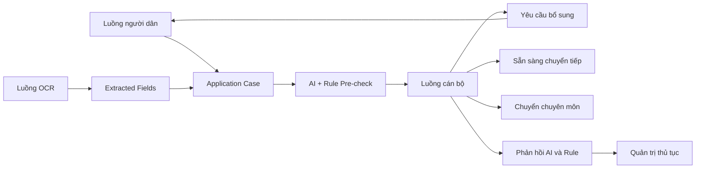
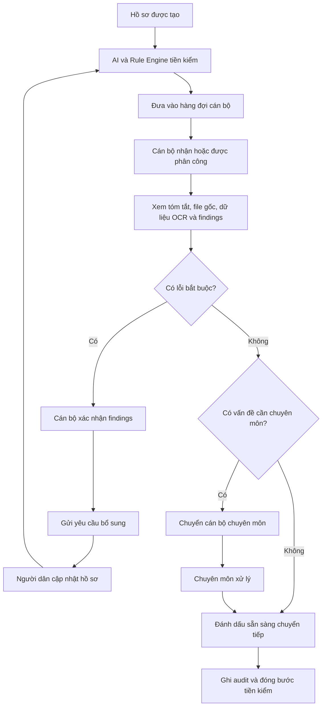
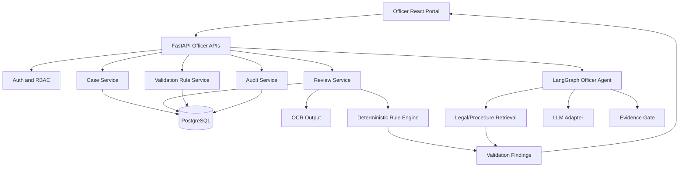

# PRODUCT REQUIREMENTS DOCUMENT (PRD)

## UBNDAI – LUỒNG XỬ LÝ DÀNH CHO CÁN BỘ

**Phiên bản:** 1.0  
**Sản phẩm:** UBNDAI – User Bridge for Navigation, Documents & AI  
**Phân hệ:** Officer Portal / Cổng xử lý hồ sơ dành cho cán bộ  
**Nền tảng:** Phát triển dựa trên repo `luythoangduy/UBNDAI`  
**Trạng thái:** Draft for implementation  

---

## 1. Tóm tắt sản phẩm

Luồng xử lý dành cho cán bộ là cổng nghiệp vụ giúp cán bộ tiếp nhận, kiểm tra và xử lý các hồ sơ đã được tạo từ hai luồng đầu vào:

1. **Luồng người dân:** Người dân mô tả nhu cầu, được AI xác định thủ tục, hướng dẫn chuẩn bị và điền hồ sơ.
2. **Luồng OCR:** Hệ thống đọc biểu mẫu, PDF, ảnh chụp hoặc bản scan và trích xuất thông tin thành dữ liệu có cấu trúc.

Khi hồ sơ được chuyển sang cổng cán bộ, hệ thống tự động:

- Xác định thủ tục và phiên bản quy định đang áp dụng.
- Tóm tắt nội dung hồ sơ.
- Đối chiếu dữ liệu với checklist và bộ quy tắc của thủ tục.
- Phát hiện trường thiếu, sai định dạng, mâu thuẫn hoặc tài liệu chưa đầy đủ.
- Xếp hạng mức độ ưu tiên của từng vấn đề.
- Cung cấp căn cứ và giải thích cho từng cảnh báo.
- Đề xuất nội dung yêu cầu người dân bổ sung.

Cán bộ là người xác nhận cuối cùng đối với các phát hiện của AI, quyết định hồ sơ cần bổ sung hay đã sẵn sàng chuyển tiếp, đồng thời ghi nhận phản hồi để cải thiện chất lượng hệ thống.

Phân hệ này **không tự động phê duyệt thủ tục hành chính** và không thay thế thẩm quyền của cán bộ hoặc cơ quan nhà nước.

---

## 2. Bối cảnh và vấn đề

### 2.1. Hồ sơ đến từ nhiều nguồn

Cán bộ có thể nhận hồ sơ từ:

- Người dân nhập trực tiếp trên cổng dịch vụ công.
- Chatbot hoặc widget hướng dẫn thủ tục.
- Biểu mẫu web.
- File Word hoặc PDF.
- Ảnh chụp, bản scan qua OCR.
- Dữ liệu từ hệ thống dịch vụ công hiện có.

Các nguồn này không đồng nhất về cấu trúc, cách viết và chất lượng dữ liệu.

### 2.2. Cán bộ phải kiểm tra nhiều lỗi lặp lại

Các lỗi phổ biến gồm:

- Thiếu trường bắt buộc.
- Thiếu tài liệu đính kèm.
- Sai mẫu đơn.
- Sai định dạng ngày, số giấy tờ hoặc mã định danh.
- Thông tin giữa biểu mẫu và tài liệu đính kèm không khớp.
- Chọn sai thủ tục hoặc sai cơ quan tiếp nhận.
- Thiếu giấy ủy quyền trong trường hợp cần thiết.
- Dùng biểu mẫu hoặc hướng dẫn đã hết hiệu lực.

Việc kiểm tra thủ công khiến thời gian xử lý kéo dài và dễ bỏ sót.

### 2.3. AI cần có cơ chế kiểm soát của con người

Kết quả AI có thể sai do:

- OCR đọc nhầm.
- Dữ liệu đầu vào không rõ ràng.
- Quy định chưa được cập nhật.
- Hai tài liệu có nội dung mâu thuẫn.
- Trường hợp thực tế nằm ngoài bộ rule đã cấu hình.

Do đó, cán bộ phải có khả năng:

- Chấp nhận hoặc bác bỏ từng cảnh báo AI.
- Chỉnh sửa dữ liệu OCR.
- Yêu cầu người dân bổ sung.
- Chuyển hồ sơ cho người có chuyên môn cao hơn.
- Ghi chú lý do cho mọi quyết định.

### 2.4. Thiếu dữ liệu để cải tiến quy trình

Nếu chỉ xử lý từng hồ sơ riêng lẻ, cơ quan khó biết:

- Thủ tục nào thường bị sai nhất.
- Giấy tờ nào người dân thường thiếu.
- Quy tắc nào AI hay phát hiện sai.
- Bước nào khiến hồ sơ bị trả lại nhiều lần.
- Cán bộ hoặc bộ phận nào đang quá tải.

Cổng cán bộ cần biến hoạt động xử lý hồ sơ thành dữ liệu có thể đo lường.

---

## 3. Mục tiêu sản phẩm

### 3.1. Mục tiêu chính

1. Giảm thời gian cán bộ dành cho việc kiểm tra lỗi cơ bản và lặp lại.
2. Giúp cán bộ nhìn thấy nhanh các vấn đề quan trọng trong từng hồ sơ.
3. Đảm bảo mọi cảnh báo AI có giải thích, nguồn và khả năng xác nhận thủ công.
4. Chuẩn hóa quy trình yêu cầu người dân bổ sung hồ sơ.
5. Lưu đầy đủ lịch sử xử lý, người thao tác và lý do quyết định.
6. Cung cấp dữ liệu phục vụ cải tiến thủ tục và trải nghiệm người dân.

### 3.2. Chỉ tiêu MVP

- 100% hồ sơ có trạng thái xử lý rõ ràng.
- 100% cảnh báo AI có mức độ, lý do và rule hoặc nguồn liên quan.
- Cán bộ có thể chấp nhận hoặc bác bỏ từng cảnh báo.
- Cán bộ có thể tạo yêu cầu bổ sung trong tối đa ba thao tác.
- 100% thay đổi dữ liệu và trạng thái được ghi audit log.
- Thời gian mở trang chi tiết hồ sơ dưới 3 giây với dữ liệu demo.
- Kết quả AI tiền kiểm hiển thị trong dưới 10 giây đối với hồ sơ đã OCR xong.

---

## 4. Phạm vi

### 4.1. Trong phạm vi MVP

- Đăng nhập và phân quyền cán bộ.
- Dashboard tổng quan.
- Danh sách hồ sơ chờ xử lý.
- Bộ lọc, tìm kiếm và sắp xếp hồ sơ.
- Phân công hồ sơ cho cán bộ.
- Trang chi tiết hồ sơ ba cột.
- Hiển thị file gốc và dữ liệu OCR.
- Hiển thị kết quả AI tiền kiểm.
- Chấp nhận, bác bỏ hoặc chỉnh sửa cảnh báo.
- Chỉnh sửa dữ liệu OCR có kiểm soát.
- Gửi yêu cầu người dân bổ sung.
- Đánh dấu hồ sơ sẵn sàng chuyển tiếp.
- Chuyển hồ sơ sang cán bộ khác hoặc cấp chuyên môn cao hơn.
- Lưu ghi chú nội bộ.
- Audit log.
- Quản lý cơ bản checklist và rule theo thủ tục.
- Thống kê cơ bản về lỗi và thời gian xử lý.

### 4.2. Ngoài phạm vi MVP

- Tự động phê duyệt hoặc từ chối hồ sơ chính thức.
- Ký số văn bản.
- Thu phí và thanh toán trực tuyến.
- Kết nối thật với toàn bộ Cổng Dịch vụ công Quốc gia.
- Tự động sửa nội dung giấy tờ gốc của người dân.
- Xử lý toàn bộ thủ tục hành chính trên toàn quốc.
- Phân tích khuôn mặt hoặc xác thực sinh trắc học.
- Tự động kết luận tính hợp pháp trong trường hợp tranh chấp.

---

## 5. Người dùng và phân quyền

### 5.1. Cán bộ tiếp nhận – `officer_reviewer`

Có quyền:

- Xem hồ sơ thuộc đơn vị hoặc hàng đợi được giao.
- Nhận và tự phân công hồ sơ nếu được cho phép.
- Xem file gốc, dữ liệu OCR và cảnh báo AI.
- Sửa dữ liệu trích xuất.
- Chấp nhận hoặc bác bỏ cảnh báo.
- Gửi yêu cầu bổ sung.
- Đánh dấu hồ sơ sẵn sàng chuyển tiếp.
- Thêm ghi chú nội bộ.

Không có quyền:

- Thay đổi bộ rule đã được công bố.
- Xóa audit log.
- Xem hồ sơ ngoài phạm vi tổ chức.

### 5.2. Cán bộ chuyên môn – `specialist`

Có toàn bộ quyền của cán bộ tiếp nhận và thêm:

- Xử lý trường hợp được chuyển cấp.
- Đưa ra kết luận chuyên môn nội bộ.
- Đề xuất cập nhật rule.
- Xác nhận trường hợp ngoại lệ.

### 5.3. Trưởng bộ phận – `supervisor`

Có quyền:

- Xem toàn bộ hồ sơ thuộc đơn vị.
- Phân công lại hồ sơ.
- Theo dõi quá hạn và tải công việc.
- Duyệt yêu cầu thay đổi rule.
- Xem dashboard và báo cáo hiệu suất.
- Mở lại hồ sơ đã đóng khi có lý do.

### 5.4. Quản trị thủ tục – `procedure_admin`

Có quyền:

- Tạo và cập nhật thủ tục.
- Quản lý checklist.
- Quản lý biểu mẫu.
- Quản lý validation rules.
- Quản lý nguồn và phiên bản hiệu lực.
- Publish hoặc rollback phiên bản rule.

---

## 6. Quan hệ giữa ba luồng



### 6.1. Contract đầu vào từ luồng người dân

Luồng người dân phải gửi tối thiểu:

- `case_id`
- `citizen_id` hoặc guest identifier
- `procedure_id`
- `procedure_version`
- Câu trả lời guided intake
- Checklist cá nhân hóa
- Dữ liệu biểu mẫu đã nhập
- Danh sách tài liệu đính kèm
- Lịch sử hội thoại cần thiết
- Consent và privacy metadata

### 6.2. Contract đầu vào từ OCR

Luồng OCR phải gửi tối thiểu:

- `document_id`
- Loại tài liệu dự đoán
- Các field đã trích xuất
- Bounding box hoặc page reference
- Confidence cho từng field
- OCR warnings
- Link đến file gốc
- Phiên bản OCR engine

### 6.3. Contract đầu ra cho luồng người dân

Luồng cán bộ có thể trả về:

- Danh sách nội dung cần bổ sung.
- Câu hỏi yêu cầu làm rõ.
- Lý do và hướng dẫn sửa.
- Hạn bổ sung nếu có.
- Trạng thái hồ sơ.
- Kết luận “đã sẵn sàng chuyển tiếp” ở mức tiền kiểm.

---

## 7. Quy trình nghiệp vụ chính



---

## 8. Mô hình trạng thái hồ sơ

| Trạng thái | Ý nghĩa |
|---|---|
| `draft` | Người dân chưa hoàn thành hồ sơ |
| `submitted_for_precheck` | Hồ sơ đã gửi sang bước tiền kiểm |
| `ocr_processing` | Đang OCR tài liệu |
| `precheck_processing` | Đang chạy rule và AI |
| `awaiting_officer_review` | Chờ cán bộ kiểm tra |
| `in_officer_review` | Cán bộ đang xử lý |
| `needs_citizen_update` | Cần người dân bổ sung hoặc sửa |
| `resubmitted` | Người dân đã gửi lại |
| `escalated` | Chuyển cán bộ chuyên môn hoặc trưởng bộ phận |
| `precheck_ready` | Đã qua tiền kiểm, sẵn sàng chuyển tiếp |
| `cancelled` | Người dân hoặc cơ quan hủy hồ sơ |
| `closed` | Đóng quy trình tiền kiểm |

### 8.1. Quy tắc chuyển trạng thái

- Chỉ cán bộ đang được phân công hoặc supervisor mới được chuyển trạng thái trong giai đoạn review.
- `precheck_ready` không đồng nghĩa với phê duyệt hành chính chính thức.
- Mọi lần chuyển trạng thái phải lưu người thao tác, thời gian và lý do.
- Hồ sơ ở `needs_citizen_update` không được sửa trực tiếp bởi cán bộ, ngoại trừ dữ liệu OCR đã được xác minh từ tài liệu gốc.
- Khi người dân nộp lại, hệ thống phải tạo một `submission_version` mới thay vì ghi đè phiên bản cũ.

---

## 9. Yêu cầu chức năng

## 9.1. FR-01 – Đăng nhập và kiểm soát truy cập

### Mô tả

Cán bộ đăng nhập vào cổng nội bộ và chỉ xem dữ liệu thuộc phạm vi tổ chức, đơn vị và vai trò được cấp.

### Acceptance criteria

- Người chưa đăng nhập không truy cập được trang cán bộ.
- Cán bộ không xem được hồ sơ ngoài organization scope.
- API kiểm tra role ở backend, không chỉ ẩn nút ở frontend.
- Hành động bị từ chối trả về mã lỗi chuẩn hóa.
- Phiên đăng nhập sử dụng access token và refresh token hiện có.

---

## 9.2. FR-02 – Dashboard tổng quan

### Nội dung hiển thị

- Tổng hồ sơ mới.
- Hồ sơ đang chờ cán bộ.
- Hồ sơ đang xử lý.
- Hồ sơ cần người dân bổ sung.
- Hồ sơ có cảnh báo nghiêm trọng.
- Hồ sơ sắp quá hạn hoặc quá hạn.
- Thời gian xử lý trung bình.
- Các lỗi thường gặp trong kỳ.

### Bộ lọc

- Khoảng thời gian.
- Thủ tục.
- Trạng thái.
- Cán bộ xử lý.
- Mức độ cảnh báo.
- Nguồn hồ sơ: nhập web, chatbot, OCR, API.

### Acceptance criteria

- Card số liệu click được để mở danh sách đã lọc.
- Dữ liệu dashboard phải lấy từ API tổng hợp, không tính hoàn toàn ở frontend.
- Không hiển thị dữ liệu cá nhân nhạy cảm trên dashboard tổng quan.

---

## 9.3. FR-03 – Hàng đợi hồ sơ

### Cột tối thiểu

- Mã hồ sơ.
- Người nộp đã che một phần thông tin.
- Tên thủ tục.
- Thời gian gửi.
- Trạng thái.
- Số lỗi bắt buộc.
- Số cảnh báo.
- Độ tin cậy OCR thấp nhất.
- Cán bộ phụ trách.
- SLA hoặc hạn xử lý.

### Chức năng

- Tìm theo mã hồ sơ hoặc tên thủ tục.
- Lọc và sắp xếp.
- Nhận xử lý hồ sơ.
- Phân công hoặc chuyển cán bộ.
- Xử lý hàng loạt các hành động không mang tính kết luận, ví dụ phân công hoặc gắn nhãn.

### Acceptance criteria

- Hai cán bộ không thể đồng thời nhận cùng một hồ sơ mà không có cảnh báo lock.
- Khi hồ sơ được nhận, `assigned_to` và `assigned_at` được ghi lại.
- Hồ sơ có lỗi nghiêm trọng được ưu tiên cao hơn theo cấu hình.

---

## 9.4. FR-04 – Trang chi tiết hồ sơ

### Bố cục đề xuất

```text
┌──────────────────────┬────────────────────────────┬───────────────────────┐
│ Tài liệu gốc         │ Dữ liệu hồ sơ             │ AI Findings           │
│ PDF/Ảnh/Word viewer  │ Form đã chuẩn hóa         │ Lỗi/cảnh báo/nguồn    │
│ Highlight theo field │ Checklist                  │ Hành động cán bộ      │
└──────────────────────┴────────────────────────────┴───────────────────────┘
```

### Khu vực header

- Mã hồ sơ.
- Thủ tục và phiên bản.
- Trạng thái.
- Người phụ trách.
- Thời gian còn lại.
- Nguồn tạo hồ sơ.
- Nút chuyển trạng thái phù hợp.

### Acceptance criteria

- Click một field OCR phải highlight vị trí tương ứng trên tài liệu gốc khi có bounding box.
- Click một finding phải highlight field hoặc tài liệu liên quan.
- Cán bộ có thể mở citation hoặc rule tạo ra cảnh báo.
- Dữ liệu nhạy cảm được che theo role.

---

## 9.5. FR-05 – AI Summary cho cán bộ

### Nội dung

AI tạo bản tóm tắt ngắn gồm:

- Người dân muốn thực hiện việc gì.
- Thủ tục được xác định.
- Các thông tin chính.
- Tài liệu đã có.
- Tài liệu còn thiếu.
- Các vấn đề quan trọng.
- Điểm cần cán bộ xác nhận.

### Nguyên tắc

- Tóm tắt chỉ sử dụng dữ liệu trong case.
- Mọi kết luận về yêu cầu hồ sơ phải liên kết với rule hoặc nguồn.
- Không tự suy đoán thông tin cá nhân chưa được cung cấp.
- Tóm tắt phải có nhãn “AI-generated summary”.

---

## 9.6. FR-06 – Danh sách findings

### Loại finding

- `missing_required_field`
- `invalid_format`
- `cross_field_conflict`
- `cross_document_conflict`
- `missing_required_document`
- `low_ocr_confidence`
- `wrong_form_version`
- `possible_wrong_procedure`
- `authority_mismatch`
- `manual_review_required`

### Mức độ

- `error`: Phải xử lý trước khi đánh dấu sẵn sàng.
- `warning`: Cần xác nhận nhưng có thể cho qua với lý do.
- `info`: Thông tin hỗ trợ.

### Trạng thái finding

- `open`
- `accepted`
- `dismissed`
- `corrected`
- `needs_citizen_update`
- `escalated`

### Acceptance criteria

Mỗi finding phải có:

- Mã finding.
- Loại.
- Mức độ.
- Field hoặc document liên quan.
- Giá trị được phát hiện.
- Lý do.
- Cách khắc phục.
- Rule ID hoặc evidence source.
- Confidence nếu do AI/OCR tạo.
- Trạng thái xác nhận của cán bộ.

---

## 9.7. FR-07 – Xác nhận hoặc bác bỏ finding

### Hành động

- Chấp nhận phát hiện.
- Bác bỏ phát hiện.
- Sửa finding.
- Chuyển thành yêu cầu bổ sung.
- Chuyển chuyên môn.

### Quy tắc

- Bác bỏ finding mức `error` bắt buộc nhập lý do.
- Hành động của cán bộ được lưu làm feedback cho evaluation.
- Không xóa finding gốc; chỉ thay đổi trạng thái và tạo review decision.

---

## 9.8. FR-08 – Chỉnh sửa dữ liệu OCR

### Mô tả

Cán bộ có thể sửa dữ liệu OCR khi quan sát thấy hệ thống đọc sai tài liệu gốc.

### Quy tắc

- Phải lưu giá trị OCR ban đầu.
- Phải lưu giá trị sau chỉnh sửa.
- Phải lưu người sửa và thời gian.
- Nếu giá trị ảnh hưởng rule, hệ thống tự chạy lại validation liên quan.
- Không cho phép cán bộ tự sửa thông tin do người dân nhập nếu không có căn cứ từ tài liệu gốc.

---

## 9.9. FR-09 – Yêu cầu người dân bổ sung

### Quy trình

1. Cán bộ chọn các findings cần bổ sung.
2. Hệ thống tạo dự thảo thông báo bằng ngôn ngữ dễ hiểu.
3. Cán bộ chỉnh sửa nội dung.
4. Cán bộ xem trước.
5. Gửi qua kênh tích hợp hoặc mô phỏng.
6. Hồ sơ chuyển sang `needs_citizen_update`.

### Nội dung yêu cầu bổ sung

- Hồ sơ hoặc trường nào cần sửa.
- Lý do.
- Cách khắc phục.
- Ví dụ nếu cần.
- Hạn bổ sung.
- Kênh thực hiện.
- Thông tin liên hệ.

### Acceptance criteria

- Không gửi nội dung trực tiếp từ LLM mà chưa qua màn hình review.
- Mọi yêu cầu phải liên kết với ít nhất một finding.
- Người dân chỉ nhìn thấy ghi chú công khai, không thấy ghi chú nội bộ.

---

## 9.10. FR-10 – Đánh dấu sẵn sàng chuyển tiếp

### Điều kiện mặc định

- Không còn finding mức `error` ở trạng thái `open`.
- Tất cả tài liệu bắt buộc đã có hoặc được cán bộ ghi nhận ngoại lệ.
- Các field bắt buộc đã có giá trị.
- Thủ tục và biểu mẫu đang dùng còn hiệu lực.
- Cán bộ đã xác nhận checklist review.

### Kết quả

- Hồ sơ chuyển sang `precheck_ready`.
- Tạo biên bản tiền kiểm nội bộ.
- Ghi rõ đây không phải quyết định phê duyệt chính thức.

---

## 9.11. FR-11 – Chuyển chuyên môn và phân công

Cán bộ có thể chuyển hồ sơ khi:

- AI xác định thủ tục với confidence thấp.
- Có trường hợp ngoại lệ.
- Quy định có nhiều cách hiểu.
- Hồ sơ có yếu tố nước ngoài hoặc trường hợp đặc biệt.
- Có nghi ngờ dữ liệu giả mạo nhưng hệ thống không đủ chức năng xác minh.

Mỗi lần chuyển phải có:

- Người gửi.
- Người nhận hoặc bộ phận nhận.
- Lý do.
- Mức độ ưu tiên.
- Ghi chú.
- Thời gian.

---

## 9.12. FR-12 – Ghi chú và trao đổi nội bộ

- Cán bộ có thể thêm ghi chú nội bộ.
- Ghi chú có thể gắn với case, field, document hoặc finding.
- Có mention cán bộ khác ở P1.
- Không hiển thị ghi chú nội bộ cho người dân.
- Không cho phép sửa âm thầm; lịch sử chỉnh sửa phải được lưu.

---

## 9.13. FR-13 – Hỏi đáp AI trên hồ sơ

Cán bộ có thể hỏi:

- “Hồ sơ này còn thiếu gì?”
- “Vì sao cần giấy ủy quyền?”
- “Thông tin nào giữa hai tài liệu đang mâu thuẫn?”
- “Rule nào tạo ra cảnh báo này?”
- “Tóm tắt lịch sử bổ sung hồ sơ.”

### Guardrails

- AI chỉ truy cập case hiện tại và kho quy định được cấp quyền.
- Câu trả lời phải có evidence.
- Không được tạo quyết định thay cán bộ.
- Nếu thiếu nguồn, phải nêu rõ không đủ căn cứ.

---

## 9.14. FR-14 – Quản lý thủ tục, checklist và rule

### Thực thể cần quản lý

- Procedure.
- Procedure version.
- Form schema.
- Required document.
- Intake question.
- Validation rule.
- Official source.
- Effective date.

### Quy trình publish

```text
Draft rule → Review → Approved → Published → Superseded/Archived
```

### Acceptance criteria

- Rule đang được case cũ sử dụng không bị sửa trực tiếp.
- Cập nhật rule phải tạo version mới.
- Case lưu rõ rule version đã dùng khi tiền kiểm.
- Có thể rollback phiên bản cấu hình.

---

## 9.15. FR-15 – Audit log

Phải lưu các sự kiện:

- Đăng nhập.
- Xem hồ sơ nhạy cảm.
- Nhận và phân công hồ sơ.
- Sửa dữ liệu OCR.
- Thay đổi finding.
- Gửi yêu cầu bổ sung.
- Chuyển trạng thái.
- Chuyển cán bộ.
- Publish rule.
- Export dữ liệu.

Audit log không được chứa:

- Toàn bộ nội dung giấy tờ nhạy cảm.
- Token hoặc API key.
- Prompt chứa dữ liệu cá nhân chưa được mask.

---

## 9.16. FR-16 – Dashboard phân tích lỗi

### KPI P1

- Top thủ tục có nhiều lỗi nhất.
- Top field thường bị thiếu.
- Top tài liệu thường thiếu.
- Tỷ lệ AI finding được cán bộ chấp nhận.
- Tỷ lệ OCR field bị sửa.
- Số vòng bổ sung trung bình.
- Thời gian xử lý theo thủ tục.
- Số hồ sơ chuyển chuyên môn.

---

## 10. Thiết kế màn hình

## 10.1. Sidebar

- Tổng quan.
- Hồ sơ.
- Hàng đợi của tôi.
- Hồ sơ cần bổ sung.
- Hồ sơ chuyển chuyên môn.
- Quản lý thủ tục.
- Thống kê.
- Audit log.

Mục hiển thị tùy theo role.

## 10.2. Dashboard

Bố cục:

1. Hàng KPI cards.
2. Biểu đồ trạng thái hồ sơ.
3. Danh sách hồ sơ ưu tiên.
4. Các lỗi phổ biến.
5. Tải xử lý theo cán bộ.

## 10.3. Danh sách hồ sơ

- Table desktop.
- Card view trên màn hình nhỏ.
- Bộ lọc lưu được.
- Quick preview khi hover hoặc click.
- Badge màu cho trạng thái và mức độ.

## 10.4. Case Review Workspace

### Trái – Document Viewer

- Chuyển giữa các tài liệu.
- Zoom, rotate và đổi trang.
- Highlight OCR field.
- Hiển thị OCR confidence.

### Giữa – Structured Application

- Thông tin người nộp.
- Dữ liệu biểu mẫu.
- Checklist tài liệu.
- Lịch sử phiên bản.
- Field được đánh dấu theo finding.

### Phải – AI Review

- Summary.
- Findings.
- Evidence.
- Suggested actions.
- Ghi chú.

### Footer action bar

- Lưu.
- Yêu cầu bổ sung.
- Chuyển chuyên môn.
- Đánh dấu sẵn sàng.

---

## 11. Mô hình dữ liệu đề xuất

## 11.1. `ApplicationCase`

```json
{
  "id": "case_uuid",
  "case_code": "UBNDAI-2026-000123",
  "organization_id": "org_uuid",
  "citizen_id": "user_uuid",
  "procedure_id": "procedure_uuid",
  "procedure_version_id": "procedure_version_uuid",
  "status": "awaiting_officer_review",
  "source_channel": "citizen_portal",
  "assigned_to": "officer_uuid",
  "priority": "normal",
  "submitted_at": "2026-07-17T10:00:00Z",
  "sla_due_at": "2026-07-18T10:00:00Z",
  "current_submission_version": 2
}
```

## 11.2. `CaseSubmissionVersion`

```json
{
  "id": "submission_uuid",
  "case_id": "case_uuid",
  "version": 2,
  "form_data": {},
  "checklist_snapshot": {},
  "procedure_rule_version": "ruleset_v3",
  "created_at": "2026-07-17T10:00:00Z"
}
```

## 11.3. `CaseDocument`

```json
{
  "id": "document_uuid",
  "case_id": "case_uuid",
  "submission_version_id": "submission_uuid",
  "document_type": "birth_certificate_form",
  "file_uri": "private://...",
  "ocr_status": "completed",
  "ocr_engine": "engine_name",
  "ocr_version": "1.0",
  "uploaded_at": "2026-07-17T09:58:00Z"
}
```

## 11.4. `ExtractedField`

```json
{
  "id": "field_uuid",
  "document_id": "document_uuid",
  "field_key": "applicant_full_name",
  "raw_value": "NGUYEN VAN A",
  "normalized_value": "Nguyễn Văn A",
  "confidence": 0.92,
  "page": 1,
  "bounding_box": [120, 220, 530, 260],
  "review_status": "unreviewed"
}
```

## 11.5. `ValidationFinding`

```json
{
  "id": "finding_uuid",
  "case_id": "case_uuid",
  "submission_version_id": "submission_uuid",
  "type": "cross_document_conflict",
  "severity": "error",
  "field_keys": ["permanent_address"],
  "message": "Địa chỉ không khớp giữa đơn và tài liệu đính kèm.",
  "suggestion": "Kiểm tra và thống nhất địa chỉ.",
  "rule_id": "rule_uuid",
  "rule_version": 3,
  "confidence": 0.98,
  "status": "open"
}
```

## 11.6. `OfficerDecision`

```json
{
  "id": "decision_uuid",
  "finding_id": "finding_uuid",
  "officer_id": "officer_uuid",
  "decision": "accepted",
  "reason": "Thông tin trên hai tài liệu thực tế khác nhau.",
  "created_at": "2026-07-17T10:15:00Z"
}
```

## 11.7. `SupplementRequest`

```json
{
  "id": "request_uuid",
  "case_id": "case_uuid",
  "created_by": "officer_uuid",
  "public_message": "Vui lòng bổ sung...",
  "finding_ids": ["finding_uuid"],
  "due_at": "2026-07-20T17:00:00Z",
  "status": "sent"
}
```

## 11.8. `CaseAuditEvent`

```json
{
  "id": "event_uuid",
  "case_id": "case_uuid",
  "actor_id": "officer_uuid",
  "event_type": "finding_dismissed",
  "object_type": "validation_finding",
  "object_id": "finding_uuid",
  "metadata": {
    "reason_code": "OCR_MISREAD"
  },
  "created_at": "2026-07-17T10:18:00Z"
}
```

---

## 12. API đề xuất

### Hồ sơ

```text
GET    /api/v1/officer/cases
GET    /api/v1/officer/cases/{case_id}
POST   /api/v1/officer/cases/{case_id}/claim
POST   /api/v1/officer/cases/{case_id}/assign
POST   /api/v1/officer/cases/{case_id}/transition
GET    /api/v1/officer/cases/{case_id}/timeline
```

### Findings

```text
GET    /api/v1/officer/cases/{case_id}/findings
POST   /api/v1/officer/findings/{finding_id}/accept
POST   /api/v1/officer/findings/{finding_id}/dismiss
POST   /api/v1/officer/findings/{finding_id}/escalate
POST   /api/v1/officer/findings/{finding_id}/request-update
```

### OCR fields

```text
GET    /api/v1/officer/documents/{document_id}/fields
PATCH  /api/v1/officer/extracted-fields/{field_id}
POST   /api/v1/officer/cases/{case_id}/rerun-validation
```

### Yêu cầu bổ sung

```text
POST   /api/v1/officer/cases/{case_id}/supplement-requests/preview
POST   /api/v1/officer/cases/{case_id}/supplement-requests
GET    /api/v1/officer/cases/{case_id}/supplement-requests
```

### AI hỗ trợ cán bộ

```text
POST   /api/v1/officer/cases/{case_id}/summary
POST   /api/v1/officer/cases/{case_id}/ask
POST   /api/v1/officer/cases/{case_id}/draft-supplement-message
```

### Dashboard

```text
GET    /api/v1/officer/dashboard/summary
GET    /api/v1/officer/dashboard/common-errors
GET    /api/v1/officer/dashboard/workload
```

### Quản trị rule

```text
GET    /api/v1/admin/procedures
POST   /api/v1/admin/procedures
POST   /api/v1/admin/procedures/{id}/versions
GET    /api/v1/admin/rules
POST   /api/v1/admin/rules
POST   /api/v1/admin/rule-sets/{id}/publish
POST   /api/v1/admin/rule-sets/{id}/rollback
```

---

## 13. Kiến trúc xử lý



### 13.1. Phân chia trách nhiệm

#### Deterministic services

Dùng cho:

- Kiểm tra field bắt buộc.
- Kiểm tra định dạng.
- Kiểm tra ngày tháng.
- So sánh giữa các field.
- Kiểm tra tài liệu bắt buộc.
- Chuyển trạng thái.
- Phân quyền.
- SLA.

#### LangGraph/LLM

Dùng cho:

- Tóm tắt hồ sơ.
- Giải thích finding bằng ngôn ngữ dễ hiểu.
- So sánh nội dung tự do giữa các tài liệu.
- Hỏi đáp trên hồ sơ.
- Soạn dự thảo yêu cầu bổ sung.

#### Không giao cho LLM

- Quyết định hồ sơ chính thức đạt hay không đạt.
- Tự chuyển trạng thái mà không có policy rõ ràng.
- Tự bác bỏ finding mức nghiêm trọng.
- Tự tạo yêu cầu hồ sơ không có trong rule hoặc nguồn.

---

## 14. Tích hợp với repo UBNDAI hiện tại

## 14.1. Thành phần tái sử dụng

- Auth, JWT và refresh token.
- Organization và role model.
- FastAPI routers và dependencies.
- Document upload và file storage.
- Parser tài liệu.
- Citation service.
- Grounding checker và evidence gate.
- Drafting service để tạo nội dung yêu cầu bổ sung.
- Conversation và history service.
- Feedback service.
- Audit/activity model.
- LangGraph agent pattern.
- React/Vite frontend và API client.
- Langfuse tracing với dữ liệu đã mask.

## 14.2. Module backend cần bổ sung

```text
src/models/cases.py
src/models/procedures.py
src/models/validation.py
src/models/officer.py

src/services/case_service.py
src/services/assignment_service.py
src/services/validation_rules.py
src/services/case_review.py
src/services/supplement_requests.py
src/services/procedure_versions.py
src/services/case_audit.py

src/agents/officer_review_agent.py

src/api/v1/officer_cases.py
src/api/v1/officer_findings.py
src/api/v1/officer_dashboard.py
src/api/v1/procedure_admin.py
```

## 14.3. Module frontend cần bổ sung

```text
frontend/src/pages/officer/OfficerDashboard.tsx
frontend/src/pages/officer/CaseQueue.tsx
frontend/src/pages/officer/CaseReview.tsx
frontend/src/pages/officer/ProcedureAdmin.tsx
frontend/src/pages/officer/OfficerAnalytics.tsx

frontend/src/components/officer/CaseTable.tsx
frontend/src/components/officer/DocumentViewer.tsx
frontend/src/components/officer/StructuredFormPanel.tsx
frontend/src/components/officer/FindingPanel.tsx
frontend/src/components/officer/CaseTimeline.tsx
frontend/src/components/officer/SupplementRequestDialog.tsx
```

### 14.4. Quy tắc kiến trúc

- API router mỏng, không chứa business logic.
- Validation rule chạy trong service riêng.
- Agent không trực tiếp ghi database nếu chưa qua service.
- Mọi mutation phải qua authorization check.
- Không đưa PII thô vào trace.
- Mọi model mới phải có Alembic migration.

---

## 15. Yêu cầu phi chức năng

### 15.1. Bảo mật

- RBAC ở backend.
- Mã hóa kết nối HTTPS.
- File lưu trong private storage.
- Signed URL có thời hạn khi xem file.
- Che CCCD, số điện thoại và địa chỉ trên danh sách.
- Không ghi PII thô vào log hoặc Langfuse.
- Audit mọi lần truy cập hồ sơ nhạy cảm.

### 15.2. Hiệu năng

- Danh sách hồ sơ phân trang server-side.
- Dashboard dùng truy vấn tổng hợp và cache ngắn hạn.
- Không gọi LLM khi chỉ cần rule hoặc dữ liệu DB.
- AI summary được cache theo submission version.
- Validation chạy lại theo rule bị ảnh hưởng, không luôn chạy toàn bộ.

### 15.3. Độ tin cậy

- Lỗi AI không làm mất dữ liệu hồ sơ.
- Nếu LLM lỗi, cán bộ vẫn xem được dữ liệu và rule findings.
- Nếu OCR lỗi, hồ sơ được gắn `manual_review_required`.
- Mutation quan trọng cần idempotency key hoặc optimistic locking.

### 15.4. Khả năng truy vết

Mọi quyết định phải truy ngược được đến:

- Submission version.
- Rule version.
- Nguồn quy định.
- AI model và prompt version nếu có.
- Cán bộ xác nhận.
- Thời điểm xử lý.

---

## 16. Chỉ số đánh giá

### 16.1. Chất lượng AI

- Finding acceptance rate.
- False positive rate.
- False negative rate trên test set.
- OCR correction rate.
- Citation coverage.
- Unsupported claim rate.

### 16.2. Hiệu quả nghiệp vụ

- Thời gian review trung bình.
- Số hồ sơ xử lý trên mỗi cán bộ.
- Số vòng bổ sung trung bình.
- Tỷ lệ hồ sơ qua tiền kiểm ngay lần đầu.
- Tỷ lệ hồ sơ chuyển chuyên môn.
- Tỷ lệ hồ sơ quá SLA.

### 16.3. Trải nghiệm cán bộ

- Số thao tác để gửi yêu cầu bổ sung.
- Tỷ lệ cán bộ sử dụng AI summary.
- Tỷ lệ chỉnh sửa nội dung AI draft.
- Mức độ hài lòng sau pilot.

---

## 17. Bộ test bắt buộc

### TC-01 – Hồ sơ hợp lệ

- Đầy đủ field và giấy tờ.
- Không có conflict.
- Cán bộ có thể đánh dấu `precheck_ready`.

### TC-02 – Thiếu trường bắt buộc

- Rule tạo finding `error`.
- Không cho đánh dấu sẵn sàng khi finding còn mở.

### TC-03 – OCR đọc sai tên

- Field confidence thấp.
- Cán bộ sửa field.
- Validation tự chạy lại.
- Lưu cả giá trị trước và sau.

### TC-04 – Mâu thuẫn giữa hai tài liệu

- Hệ thống highlight cả hai nguồn.
- Cán bộ chuyển thành yêu cầu bổ sung.

### TC-05 – Bác bỏ cảnh báo AI

- Bắt buộc nhập lý do nếu severity là error.
- Feedback được lưu.

### TC-06 – Hai cán bộ cùng nhận hồ sơ

- Một người nhận thành công.
- Người còn lại nhận thông báo hồ sơ đã được lock hoặc phân công.

### TC-07 – Hồ sơ nộp lại

- Tạo submission version mới.
- Giữ lịch sử phiên bản cũ.
- Chỉ findings của phiên bản mới được dùng cho trạng thái hiện tại.

### TC-08 – Rule thay đổi

- Hồ sơ cũ giữ rule version cũ.
- Hồ sơ mới dùng rule version đã publish.

### TC-09 – Không đủ nguồn

- AI không kết luận chắc chắn.
- Finding chuyển thành `manual_review_required`.

### TC-10 – Truy cập trái phép

- Cán bộ organization A không xem được hồ sơ organization B.

---

## 18. Ưu tiên phát triển

## P0 – Demo bắt buộc

1. Role cán bộ.
2. Danh sách hồ sơ.
3. Trang chi tiết ba cột.
4. Dữ liệu OCR và file viewer.
5. Validation findings.
6. Accept/dismiss finding.
7. Yêu cầu bổ sung.
8. Đánh dấu sẵn sàng tiền kiểm.
9. Audit log.
10. Một thủ tục được triển khai sâu end-to-end.

## P1 – Tạo khác biệt

1. AI summary.
2. Hỏi đáp trên case có citation.
3. Chuyển chuyên môn.
4. SLA và cảnh báo quá hạn.
5. Dashboard lỗi phổ biến.
6. Procedure/rule version management.
7. Feedback loop cho AI.

## P2 – Sau cuộc thi

1. Kết nối hệ thống dịch vụ công thật.
2. Notification đa kênh.
3. Bulk operations nâng cao.
4. Phân tích tải công việc.
5. Tự động phát hiện rule cần cập nhật.
6. Active learning từ quyết định cán bộ.

---

## 19. Kế hoạch triển khai đề xuất

### Giai đoạn 1 – Nền dữ liệu và workflow

- Tạo models và migration.
- Tạo status machine.
- Tạo API danh sách và chi tiết hồ sơ.
- Tích hợp output từ OCR.
- Tạo rule findings cơ bản.

### Giai đoạn 2 – Officer UI

- Dashboard.
- Case queue.
- Case review workspace.
- Accept/dismiss finding.
- Supplement request.

### Giai đoạn 3 – AI và evidence

- AI summary.
- Draft thông báo bổ sung.
- Case Q&A.
- Citation và grounding.

### Giai đoạn 4 – Hardening và demo

- RBAC.
- Audit.
- Test end-to-end.
- Chuẩn bị dữ liệu lỗi có chủ ý.
- Tối ưu latency.
- Deploy public demo với tài khoản cán bộ mẫu.

---

## 20. Kịch bản demo phần cán bộ

1. Cán bộ đăng nhập và thấy ba hồ sơ mới.
2. Một hồ sơ được ưu tiên do có hai lỗi bắt buộc và một OCR confidence thấp.
3. Cán bộ mở hồ sơ.
4. AI hiển thị tóm tắt nhu cầu và các tài liệu đã có.
5. Cán bộ click finding “địa chỉ không khớp”.
6. Hệ thống highlight địa chỉ trên hai tài liệu khác nhau.
7. Cán bộ phát hiện một field OCR bị đọc sai và chỉnh lại.
8. Rule engine chạy lại, một finding tự biến mất.
9. Cán bộ chấp nhận finding còn lại.
10. Hệ thống sinh dự thảo yêu cầu bổ sung.
11. Cán bộ chỉnh một câu và gửi.
12. Người dân cập nhật hồ sơ ở luồng ngoài.
13. Hồ sơ quay lại với version mới.
14. Cán bộ xác nhận không còn lỗi bắt buộc.
15. Hồ sơ được đánh dấu “Sẵn sàng chuyển tiếp”.
16. Timeline hiển thị toàn bộ lịch sử xử lý.

**Thông điệp demo:** AI không thay cán bộ quyết định; AI giúp cán bộ nhìn đúng vấn đề, kiểm tra nhanh hơn và giải thích rõ ràng hơn cho người dân.

---

## 21. Definition of Done cho MVP

MVP được coi là hoàn thành khi:

- Có ít nhất một tài khoản cán bộ và một tài khoản supervisor.
- Có ít nhất một thủ tục hoạt động end-to-end.
- Hồ sơ từ luồng người dân và OCR xuất hiện trong officer queue.
- Cán bộ xem được file gốc, dữ liệu trích xuất và findings.
- Cán bộ có thể sửa OCR field.
- Cán bộ có thể accept/dismiss findings.
- Cán bộ có thể gửi yêu cầu bổ sung.
- Hồ sơ có submission version mới sau khi bổ sung.
- Cán bộ có thể đánh dấu sẵn sàng tiền kiểm.
- Mọi hành động quan trọng có audit log.
- RBAC được kiểm thử.
- Demo hoạt động trên public URL.
- Không có dữ liệu cá nhân thật trong bộ demo.

---

## 22. Rủi ro và biện pháp giảm thiểu

| Rủi ro | Biện pháp |
|---|---|
| AI tạo nhiều cảnh báo sai | Rule deterministic cho lỗi chắc chắn; officer feedback; confidence threshold |
| OCR đọc sai | Hiển thị confidence, bounding box và cho phép sửa |
| Quy định thay đổi | Version thủ tục, rule và nguồn; không sửa đè |
| Cán bộ quá phụ thuộc AI | Hiển thị nguồn, yêu cầu xác nhận, không tự phê duyệt |
| Rò rỉ dữ liệu cá nhân | RBAC, private storage, masking, audit |
| Hai cán bộ sửa cùng hồ sơ | Optimistic lock hoặc case claim |
| Demo quá rộng | Chọn một thủ tục sâu, một kịch bản lỗi rõ ràng |
| LLM chậm hoặc lỗi | Cache summary, fallback rule-based, UI vẫn hoạt động |

---

## 23. Kết luận

Luồng cán bộ là lớp kiểm soát và xác nhận trung tâm của UBNDAI. Giá trị chính không nằm ở việc AI tự đưa ra quyết định, mà ở khả năng:

- Chuẩn hóa hồ sơ từ nhiều nguồn.
- Đưa các lỗi quan trọng lên trước.
- Liên kết cảnh báo với dữ liệu và căn cứ.
- Cho phép cán bộ xác nhận hoặc sửa kết quả AI.
- Giao tiếp rõ ràng với người dân.
- Lưu đầy đủ lịch sử để kiểm tra và cải tiến.

Định vị ngắn gọn:

> **Officer Portal là trung tâm tiền kiểm có con người giám sát, giúp cán bộ xử lý hồ sơ nhanh hơn nhưng vẫn bảo đảm quyền quyết định và trách nhiệm thuộc về cơ quan có thẩm quyền.**
